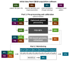

# EBSD Pseudosymmetry Reindexing Pipeline

A Python-based EBSD reindexing pipeline for distinguishing pseudosymmetric variants using simulated pattern matching, optimized pattern preprocessing, neighbor pattern averaging, global sample-detector geometry refinement, and pseudosymmetry-sensitive confidence index for final variant selection. 

Please refer to the following papers for the full methodology descriptions: 
1. C. Griesbach, T. Scharsach, M. Trassin, D.M. Kochmann, Ferroelectric polarization mapping through pseudosymmetry-sensitive EBSD reindexing, Acta Materialia, (2026). https://doi.org/10.1016/j.actamat.2026.122386
2. C. Griesbach, D.M. Kochmann, Global DIC-based sample-detector geometry refinement for accurate EBSD indexing, (2026). https://doi.org/10.48550/arXiv.2604.25869.

<p align="center">
  
</p>

## Overview

This repository implements a multi-step EBSD reindexing workflow designed for challenging pseudosymmetry materials. The code is organized as a sequential pipeline:

1. **Import and pattern processing**  
   Import raw vendor data (EDAX or Oxford), build the initial detector/orientation map, optimize image processing parameters and apply to the full pattern stack.
2. **Pseudosymmetry-sensitive neighbor pattern averaging (PSS-NPA)**  
   Improve pattern quality before reindexing by averaging locally similar neighbors, while retaining PS variant differences.
3. **DIC-based global geometry refinement**  
   Refine sample-detector geometry using map-wide displacement signatures between experimental and simulated patterns.
4. **Final pseudosymmetry-sensitive refinement through maximum CI<sub>PS</sub> selection**  
   Refine orientations within each pseudosymmetry space separately (one job per variant), compute PS-sensitive confidence metrics, and select the best variant per pixel.

The scripts are intended for **high-performance execution on ETH Euler / Slurm-based systems**, with MPI/Dask used in the more computationally intensive steps. The entire pipeline is driven by a single **TOML configuration file** (see [`examples/PS-EBSD_config.toml`](examples/PS-EBSD_config.toml)) rather than command-line flags or environment variables — one file defines the dataset, instrument, pseudosymmetry operators, per-stage algorithm parameters, and per-stage Slurm resource requests.

---

## Workflow

### Part 1A — Import + pattern processing (`ReindexingPS_Part1A_ImportPatternProcessing.py`)

This step:

- loads the pipeline configuration and launches a Dask-MPI cluster
- imports the raw EBSD data for the configured `instrument`:
  - **Oxford**: `{mapname}.h5oina` (detector geometry can be auto-loaded from the file header)
  - **EDAX**: `{mapname}.h5` + `{mapname}.ang` (detector geometry must be supplied in the config)
- crops the detector and patterns to a square signal region and builds the initial `EBSDDetector`/`CrystalMap`
- writes an H5 template for the downstream stages
- performs a small orientation + projection-center refinement at a single navigation point (`opt_y`, `opt_x`) with pseudosymmetry operators enabled
- optimizes a preprocessing pipeline using Bayesian optimization (`gp_minimize`)
- applies the selected preprocessing to the entire dataset, saved in parallel via Dask workers

#### Pattern-processing stages

The optimized preprocessing pipeline includes:

- dynamic background subtraction
- optional adaptive histogram equalization
- FFT-based bandpass filtering

Other image processing steps can be easily added or swapped in. 

#### Part 1A outputs

- `MAPNAME_InitialDetector.txt` — initial extrapolated detector field  
- Processed pattern H5 file (path depends on the `overwriteH5` config setting — see [Configuration](#configuration))  
- `MAPNAME_PatProc_y{opt_y}_x{opt_x}.png` — diagnostic figure at the optimization point  
- `MAPNAME_PatProc_random*.png` — diagnostic figures at a few random points

---

### Part 1B — Pseudosymmetry-sensitive neighbor pattern averaging (`ReindexingPS_Part1B_NPA_MPI.py`)

This stage performs non-local neighbor pattern averaging using MPI/Dask. It pads the pattern stack in navigation space, distributes the work across workers, computes the normalized cross-correlation between each pattern and its local neighborhood, and uses a **first-jump cutoff** strategy to identify a suitable neighbor set for averaging.

The goal is to improve pattern quality while avoiding averaging across dissimilar (PS-variant) neighborhoods.

#### Part 1B outputs

This stage writes the averaged patterns to a new HDF5 dataset used by later stages:

- `MAPNAME_PP_NPA<RADIUS>.h5` (path depends on `overwriteH5`)

It can also generate diagnostic plots for a set of target pixels, depending on the `[part1B]` config settings.

---

### Part 1C — Global geometry refinement (`ReindexingPS_Part1C_GlobalGeomRefine.py`)

This step loads the NPA-processed patterns, the original map, the initial detector, and the master pattern, then performs iterative **global sample-detector geometry refinement** on a subset of `n_points` points.

The geometry refinement is handled by `optimize_geometry_and_orientations()` in `EBSD_refine_geometry.py`. The implementation couples:

- simulated pattern generation from the current geometry
- displacement-field estimation between experimental and simulated patterns
- Jacobian-based geometry updates for the parameters listed in `keys` (e.g. `pcx`, `pcy`, `pcz`, `sample_tilt`, `azimuthal`, `tilt`, `twist`)
- orientation refinement under the updated geometry
- acceptance/rejection of each update based on post-refinement NCC improvement

#### Part 1C outputs

- `MAPNAME_CalibratedDetector.txt` — refined detector field extrapolated back to the full map  
- `MAPNAME_GeomRefine/` — geometry-refinement diagnostics and iteration outputs

---

### Part 2A — Per-variant PS orientation refinement + CI/WCC (`ReindexingPS_Part2A_NCCref.py`)

Runs once per pseudosymmetry variant (variant `0` is the original map; variants `1..N` are seeded by rotating the original orientations with the `PS_rotations` defined in the config). Each variant runs as an **independent Slurm job**, submitted in parallel (optionally staggered — see `stagger_minutes` in [Configuration](#configuration)):

- loads the NPA-processed patterns and calibrated detector (falls back to the H5-embedded detector, with a warning, if `MAPNAME_CalibratedDetector.txt` is missing)
- builds the variant's orientation seed
- refines orientations within that variant's orientation space (`scipy` `Powell` by default)
- computes CI<sub>wcc</sub>-related metrics via `compute_wcc_map()`
- supports resuming: skips work that is already present in its output files

#### Part 2A outputs (per variant, under `MAPNAME_{outdir_suffix}/`)

- `MAPNAME_Refine1step_V{variant}.ang`
- `MAPNAME_CIwcc_V{variant}.h5`

---

### Part 2B — Variant selection and final map assembly (`ReindexingPS_Part2B_PSselect.py`)

Runs once, after all Part 2A variant jobs have completed:

- verifies all expected Part 2A outputs exist for all `N = len(PS_rotations) + 1` variants
- assembles the CI stack across variants and selects the best variant per pixel (`argmax`)
- computes a cross-variant margin
- merges the per-variant HDF5 groups plus a `Final/` group into one file
- builds and saves the final selected `CrystalMap`

#### Part 2B outputs (under `MAPNAME_{outdir_suffix}/`)

- `MAPNAME_CIwcc_data.h5` — per-variant and final confidence datasets, including:
  - `V0/` … `VN/` groups with `CI_map`, `eta_map`, `Xi_e_map`, `Xi_t_map`, `Xi_eN_map`
  - `Final/best_idx`, `Final/cross_variant_margin`, `Final/Xi_t`, `Final/Xi_eN`, `Final/Xi_e`, `Final/CI_sel`
- `MAPNAME_FinalSelected.ang` — final selected map after PS variant selection

---

### Helper modules

#### `pipeline_io.py`
Central config-driven I/O helpers used by every stage: loading and validating the TOML config, resolving the dataset/output paths for each stage (`h5_path_for_stage`), and reading stage-specific settings (`get_instrument`, `get_detector_config`, `get_ps_rotations`, `get_overwrite_h5`, `get_part1b_radius`).

#### `EBSD_extra_functions.py`
Contains utility functions used across the pipeline, including for example:

- detector cropping
- chunk-size selection for Dask
- EBSD subset extraction (`EBSD_subset`)
- binned detector construction
- CI<sub>wcc</sub> calculations (`compute_wcc_map`)
- diagnostic GIF generation (`make_flash_gif`)

#### `EBSD_extra_functions_numba.py`
Contains utility functions using only numba for fast computations. 

#### `EBSD_refine_geometry.py`
Contains the geometry-refinement implementation, including:

- pattern simulation helpers
- ROI subdivision and visualization tools
- PCC- and sparse-feature-based displacement estimation
- iterative geometry refinement with optional PC updates
- orientation-refinement / NCC-based acceptance logic

---

## Configuration

The whole pipeline is configured through a single TOML file — see [`examples/PS-EBSD_config.toml`](examples/PS-EBSD_config.toml) for a fully commented template. Its sections:

- **`[global]`** — settings shared across all stages: `instrument` (`"oxford"` or `"edax"`), `pname`/`mapname`/`mp_path` (input data locations), `energy_kV`, `PS_rotations` (pseudosymmetry operators as `[axis_x, axis_y, axis_z, angle_deg]` rows — define these for your material), and `overwriteH5` (whether each stage overwrites the canonical H5 file in place, or writes new intermediate files).
- **`[resources.Part1A]`, `[resources.Part1B]`, `[resources.Part1C]`, `[resources.Part2A]`, `[resources.Part2B]`** — Slurm resource requests (`time`, `ntasks`, `nodes`, `cpus_per_task`, `mem_per_cpu`, and `stagger_minutes` for `Part2A`) used by `submit_pipeline.sh` when submitting jobs; these override the `#SBATCH` defaults baked into the `run_Part*.sh` wrapper scripts.
- **`[part1A]`** — pattern-processing optimization point, Dask save chunking, and detector-geometry overrides (required for EDAX; optional overrides for Oxford's auto-loaded header values).
- **`[part1B]`** — neighbor pattern averaging parameters (search radius, NCC-jump detection thresholds, diagnostics).
- **`[part1C]`** — geometry refinement parameters (`n_points`, `keys`/`steps` to refine, DIC ROI grid, iteration limits).
- **`[part2]`** — orientation refinement and CI/WCC selection settings shared by Part 2A/2B (`outdir_suffix`, `minimize_method`, `maxiter`, `trust_region`, `rtol`).

Copy the example config, fill in your dataset paths and pseudosymmetry operators, and adjust resource/algorithm parameters as needed for your map size and cluster.

Additionally, it is necessary to define the pseudosymmetry operations for your material in `PS_rotations`, ideally from a set of axes and angles.

There are many other parameters and function options in the scripts that may need to be changed.

---

## Dependencies

### Core Python dependencies
- `numpy`
- `matplotlib`
- `h5py`
- `kikuchipy`
- `orix`
- `hyperspy`
- `scikit-optimize`
- `scikit-image`
- `opencv-python`
- `scipy`
- `dask`
- `distributed`
- `dask-mpi`
- `imageio`
- `tqdm`
- `numba`

### HPC dependencies
Needed for MPI-parallel steps:
- `dask-mpi`
- MPI implementation such as OpenMPI

Additional notes:
- the specific versions used are listed in `requirements.txt`
- The ETH Euler-specific module load stack/2024-06 python/3.12.8 and module load openmpi/4.1.6 lines in the Slurm scripts are examples for the Euler environment only. On other systems, users should install an equivalent Python 3.12 environment and an MPI implementation if running Parts 1B or 2A.

---
## Example installation

This code was developed and tested with Python 3.12.8.

### 1. Clone the repository
```
git clone https://github.com/cgri2/PS-EBSD
cd PS-EBSD
```

### 2. Create a virtual environment
```
python3.12 -m venv psebsd_env
source psebsd_env/bin/activate
```

### 3. Install required packages
```
pip install --upgrade pip
pip install -r requirements.txt
```

---

## Automatic submission of the full pipeline using slurm

The pipeline is submitted with `cluster_run/submit_pipeline.sh`, which reads everything it needs from your config file and chains the Slurm jobs for each stage using `afterok` dependencies (Part 2A's per-variant jobs can additionally be staggered relative to each other via `stagger_minutes`).

### Submit the full pipeline

```bash
bash cluster_run/submit_pipeline.sh \
  --config /path/to/PS-EBSD_config.toml \
  --start-from 1A \
  --end-on 2B
```

### Restart from an intermediate stage

```bash
bash cluster_run/submit_pipeline.sh \
  --config /path/to/PS-EBSD_config.toml \
  --start-from 1C \
  --end-on 2B
```

Allowed values for `--start-from`/`--end-on` are:

- `1A`
- `1B`
- `1C`
- `2A`
- `2B`

`examples/run_pipeline.sh` is a ready-to-copy template for this: fill in `EXAMPLE_DIR` (folder containing your config) and `REPO_ROOT` (path to this repository), then submit it with `sbatch examples/run_pipeline.sh`.

---

## Slurm wrappers

The repository includes ready-to-use Slurm scripts for each stage, invoked by `submit_pipeline.sh`:

- `run_Part1A.sh`
- `run_Part1B_MPI.sh`
- `run_Part1C.sh`
- `run_Part2A_MPI.sh`
- `run_Part2B.sh`

Each wrapper has fallback `#SBATCH` defaults, but the resource request actually used for a run is set per-stage in your config file's `[resources.Part*]` sections (see [Configuration](#configuration)) — adjust those rather than editing the wrapper scripts directly.
